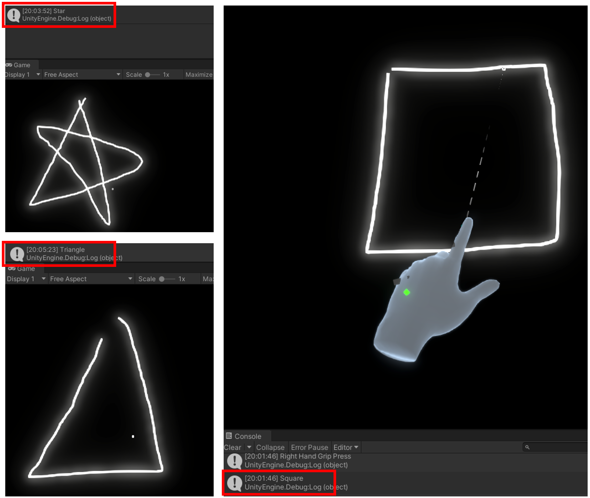

# MagicClassifier(I Wanna Be a Wizard)
## NOT RELEASED
MagicClassifier includes GRPC server for shape classification
Server responses convert shpae image to string 
1. Train data : python manage.py train
2. Run server : python manage.py runserver
MagicClassifier is 


current status image(2022-01-10)

TODO: add architecture image

## To Start...

### Envrionment Settings
Generic settings on Python 3.9
```
$ python -m pip install virtualenv
$ python -m virtualenv venv
```
Linux
```
$ source venv/bin/activate
(venv)$ python -m pip install -r requirements.txt
```
Windows
```
$ venv/Scripts/activate
(venv)$ python -m pip install -r requirements_win32.txt
```

### Compile protobuf and grpc, 
> [Download Protocol Buffers](https://developers.google.com/protocol-buffers/docs/downloads) \
> [GRPC Documents](https://grpc.io/docs/languages/python/basics/)

Compile protobuf for python
```
(venv)$ python -m grpc_tools.protoc -I=./proto/ --python_out=./wizard/proto/ --grpc_python_out=./wizard/proto/ ./proto/wizard_system.proto
```
or
```
(venv)$ python manage.py migrateprotobuf
```

Compile protobuf for csharp
```
$ .\proto\protoc -I=./proto/ --csharp_out=./csharp --grpc_out=./csharp --plugin=protoc-gen-grpc=./proto/grpc_csharp_plugin.exe ./proto/wizard_system.proto
```

# Wizard Server

### Train data
> model default is 'model/model_classfication'
```
(venv)$ python manage.py train <model>
```

### Start server
> model default is 'model/model_classfication'
```
(venv)$ python manage.py runserver <model>
```


# TODO:


# Release:
